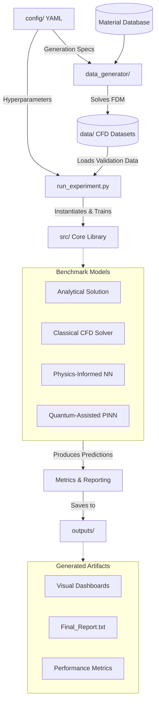

# QA-PINN for Transient Heat Equation

## Project Overview
A research-grade computational framework benchmarking Quantum-Assisted Physics-Informed Neural Networks (QA-PINN) against traditional Physics-Informed Neural Networks (PINN), Computational Fluid Dynamics (CFD) solvers, and analytical solutions for solving the transient heat conduction equation (Fourier's law) in 1D, 2D, and 3D. 

This project provides a highly reproducible pipeline for evaluating the effectiveness of quantum-enhanced machine learning methods in simulating physical phenomena across 14 different aerospace and industrial materials.

## Research Objective
To investigate whether hybrid quantum-classical machine learning (QA-PINN) can augment or outperform classical numerical PDE solvers and standard PINNs for heat transfer applications, providing a reproducible, material-aware experimental environment with real material properties (thermal conductivity $k$, density $\rho$, specific heat $c_p$, thermal diffusivity $\alpha$).

## Key Features
- **Quantum-Assisted PINNs (QA-PINN)**: Integrates PennyLane variational quantum circuits with PyTorch to solve partial differential equations.
- **Physics-Informed Neural Networks (PINN)**: Standard autograd-based continuous PDE solvers.
- **Classical CFD Solvers**: Implicit finite difference methods (e.g., Crank-Nicolson, ADI) serving as baseline numerical comparisons.
- **Analytical Solutions**: Closed-form Fourier mode solutions for absolute ground-truth validation.
- **Material Database**: 14 distinct engineering materials (e.g., Copper, Aluminium 6061, Tungsten, Titanium Ti-6Al-4V) with real-world thermal properties.
- **Multi-dimensional Support**: Supports 1D line, 2D square, and 3D cube heat conduction simulations.

## Project Architecture

Below is a visual representation of the end-to-end benchmarking pipeline and data flow:



### Module Breakdown
- **`config/`**: Global YAML configurations for datasets and model hyperparameters.
- **`data_generator/`**: CFD dataset generator utilizing implicit Finite Difference Methods (FDM) to produce physically valid heat transfer simulations.
- **`data/`**: Immutable, generated CFD datasets serving as validation data for the machine learning models.
- **`src/`**: Core implementations of solvers (Analytical, CFD, PINN, QA-PINN), PDE definitions (1D, 2D, 3D), and evaluation metrics.
- **`outputs/`**: Generated evaluation results, comparison dashboards, error heatmaps, and final technical reports.
- **`run_experiment.py`**: The main benchmark pipeline orchestrator.
- **`generate_dataset.py`**: The entry point for building custom CFD datasets.

## Installation Instructions

1. Clone the repository:
```bash
git clone https://github.com/iamhariharan7/QA-PINN-for-Transient-Heat-Equation.git
cd QA-PINN-for-Transient-Heat-Equation
```

2. Install dependencies via pip:
```bash
pip install -r requirements.txt
```
*(Note: Requires PyTorch, PennyLane, NumPy, SciPy, Pandas, and Matplotlib).*

Alternatively, using conda:
```bash
conda env create -f environment.yml
conda activate qa-pinn
```

## Usage

**1. Running the benchmark experiment:**
To load the existing datasets, train the models (1D, 2D, 3D), evaluate the solvers, and generate dashboards and reports:
```bash
python run_experiment.py
```

**2. Generating CFD datasets:**
If you wish to generate new ground-truth data from scratch for specific materials:
```bash
python generate_dataset.py
```

## Supported Materials
The built-in material database includes:
- Aluminium 6061
- Carbon-Carbon Composite
- Copper
- Diamond
- Graphite
- Inconel 718
- LI-900 Silica Tile
- Mild Steel
- Silicon
- Silicon Carbide
- Stainless Steel 304
- Titanium Ti-6Al-4V
- Tungsten
- Alumina

## Citation Information
Please refer to the `CITATION.cff` file when citing this framework in academic publications.
